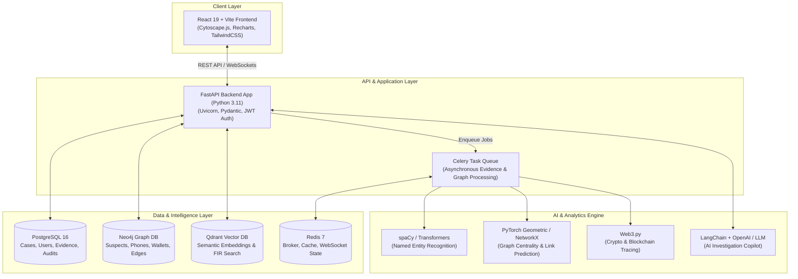

# DETECTRA (Nexus Crime AI) — System Architecture & Technical Report

## 1. Executive Summary

**DETECTRA** (Nexus Crime AI) is an advanced, AI-powered criminal network intelligence and law enforcement investigation platform. It transforms unstructured crime data (FIRs, call detail records, financial transactions, crypto wallets, evidence reports) into actionable intelligence through interactive graph visualization, natural language entity extraction, vector semantic search, and link prediction.

---

## 2. High-Level Architecture Overview

---

## 3. Technology Stack Breakdown

### A. Frontend Layer
* **Framework**: React 19 + Vite 8 + TypeScript
* **State & Routing**: React Router DOM v7
* **Graph Visualization**: **Cytoscape.js** (Renders complex multi-node suspect/organization networks with physics layout algorithms).
* **Analytics & Data Viz**: **Recharts** (Crime trends, timeline charts, risk distribution).
* **Styling & Icons**: TailwindCSS v4 + Lucide React.
* **HTTP Client**: Axios (configured with JWT interceptors).

### B. Backend API & Processing Layer
* **Framework**: **FastAPI** (Async ASGI framework powered by Uvicorn).
* **Authentication**: JWT tokens (`python-jose`) + Bcrypt password hashing.
* **ORM & Database Drivers**: **Async SQLAlchemy 2.0** + `asyncpg` driver.
* **Task Queue**: **Celery** with Redis broker for asynchronous background parsing (PDF extraction, graph expansion, heavy ML inferences).

### C. Multi-Database Storage Tier
1. **PostgreSQL 16 (Relational Database)**:
   - Primary data store for structured operational records: User accounts, Roles, Case Metadata, Evidence files metadata, Audit logs.
2. **Neo4j 5 (Property Graph Database)**:
   - Stores entities (`Suspect`, `Organization`, `PhoneNumber`, `CryptoWallet`, `Location`) and their complex relationships (`CO_SUSPECT`, `CALL_MADE`, `TRANSFERRED_FUNDS`, `ASSOCIATED_WITH`).
3. **Qdrant (Vector Search Engine)**:
   - High-performance vector database storing text embeddings of FIRs, interrogation notes, and evidence transcripts for instant semantic search.
4. **Redis 7 (In-Memory Cache & Message Broker)**:
   - Message broker for Celery queues and real-time event distribution.

### D. AI / ML & Analytics Suite
* **spaCy & Transformers**: Custom Named Entity Recognition (NER) for extracting suspect names, phone numbers, vehicle registration numbers, and addresses from uploaded documents.
* **NetworkX & PyTorch Geometric**: Graph algorithms computing degree centrality, PageRank, betweenness, and Louvain community detection to spot key gang leaders and hubs.
* **Web3.py**: Smart contract and Ethereum/crypto transaction analysis for tracking illicit financial flows.
* **LangChain**: AI Assistant agent integrated with database context to answer complex investigator questions in plain English.

---

## 4. How the System Works (End-to-End Workflow)

1. **User Authentication & Role Management**:
   - Officers log in via JWT authentication. System enforces Role-Based Access Control (RBAC) across *Investigator*, *Analyst*, and *Admin*.

2. **Data Ingestion & Pipeline**:
   - Investigator uploads evidence (PDF FIRs, Call Detail Records, Transaction CSVs).
   - FastAPI streams files to disk and triggers an asynchronous Celery task.
   - Celery parses text via `pdfplumber` and runs NLP NER to detect entities (people, locations, phone numbers, crypto addresses).

3. **Graph Construction & Vector Indexing**:
   - Extracted entities and relationships are written into **Neo4j graph nodes and edges**.
   - Text chunks are converted into vector embeddings and indexed in **Qdrant**.

4. **Interactive Network Analysis**:
   - Front-end fetches graph topologies via REST API.
   - Cytoscape renders dynamic, interactive graph nodes. Investigators can expand nodes (1-hop, 2-hop analysis), filter by risk score, or execute graph centrality metrics to pinpoint key targets.

5. **Semantic & Hybrid Search**:
   - Investigators can search conceptually (e.g. *"Smuggling operations near coastal borders involving hawala channels"*).
   - Qdrant finds semantically matching evidence while Neo4j maps connected entities.

6. **Real-time Alerting & AI Assistant**:
   - WebSocket feeds notify users of high-priority alerts (e.g. repeat suspect matches, high-risk money laundering paths).
   - The AI Assistant panel lets investigators query case files conversationally.

---

## 5. Container Deployment Topology (`docker-compose.yml`)

The platform is orchestrated into 7 dockerized microservices:

| Service Name | Base Image / Context | Port Mapping | Purpose |
| :--- | :--- | :--- | :--- |
| **`frontend`** | `nexus-crime-ai-frontend` (Vite / Nginx) | `5173:5173` | React Web Application UI |
| **`backend`** | `nexus-crime-ai-backend` (FastAPI / Uvicorn) | `8000:8000` | Core REST API Server |
| **`celery_worker`** | `nexus-crime-ai-backend` (Celery) | Internal | Asynchronous AI & Document Processing |
| **`postgres`** | `postgres:16-alpine` | `5432:5432` | Relational Storage |
| **`neo4j`** | `neo4j:5-community` | `7474:7474`, `7687:7687` | Knowledge Graph DB & Browser |
| **`qdrant`** | `qdrant/qdrant:latest` | `6333:6333` | Vector Database |
| **`redis`** | `redis:7-alpine` | `6379:6379` | Cache & Message Broker |

---
*Generated by DETECTRA System Architecture Core*
Team memebers{
   Maanvitha M from AIML
   Nithin U M from AIML
   R Anupama from CSE
   Narendra reddy B S from CSE
   Bavya shree T from ISE
   T Neelavathi from ISE
}